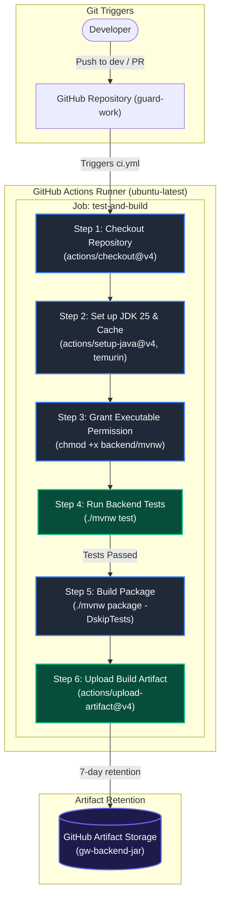

# Continuous Integration Workflows

This directory contains the GitHub Actions workflow specifications for the **GuardWork** project.

## Workflow Overview: `ci.yml`

The `ci.yml` pipeline automates testing, packaging, and artifact retention for backend code changes.

### How to use
- **Push**: Any code push to the `dev` branch.
- **Pull Request**: Any pull request targeting the `main` or `dev` branches.

---

## Flowchart Diagram

## Step Summary

| Step # | Action Name | Command / Action | Description |
| :---: | :--- | :--- | :--- |
| **1** | Checkout Repository | `actions/checkout@v4` | Fetches repository source code into the runner workspace. |
| **2** | Set up JDK 25 | `actions/setup-java@v4` | Installs JDK 25 (Temurin) and enables Maven dependency caching. |
| **3** | Grant execute permission | `chmod +x backend/mvnw` | Ensures the Maven wrapper script has executable flags. |
| **4** | Run Backend Tests | `./mvnw test` | Runs unit and database integration tests in `backend/`. |
| **5** | Build Application Package | `./mvnw package -DskipTests` | Compiles source code into executable JAR (`backend/target/*.jar`). |
| **6** | Upload Build Artifact | `actions/upload-artifact@v4` | Retains `gw-backend-jar` in GitHub storage for 7 days. |

## Future Roadmap
+ Add **SonarQube** server (for code analysis)
+ Add deployment stage with **Render**