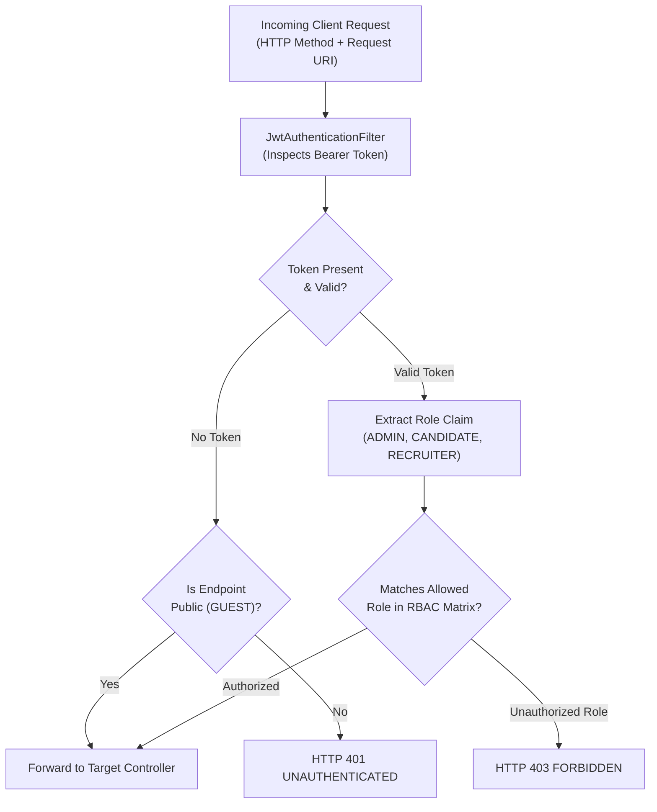
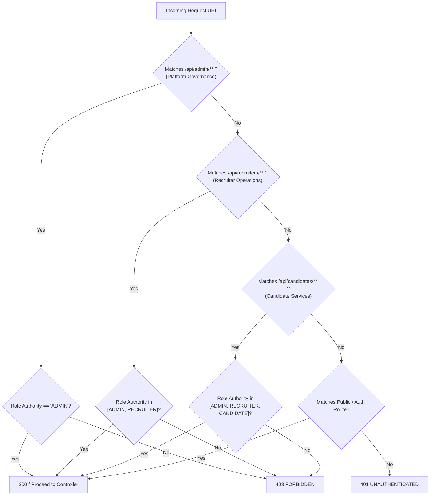

# Role-Based Access Control (RBAC) Matrix — Software Requirements Specification

| Field | Value |
|---|---|
| **Project** | GuardianWork |
| **Module** | Admin Governance & System-Wide RBAC Matrix |
| **File** | `rbac_matrix.md` |
| **Version** | 1.0.0 |
| **Date** | 2026-09-29 |
| **Status** | Approved Specification |

---

## Table of Contents

1. [Introduction](#1-introduction)
2. [Overall Description](#2-overall-description)
3. [Data Models](#3-data-models)
4. [Functional Requirements](#4-functional-requirements)
5. [Flow Diagrams](#5-flow-diagrams)
6. [Business Rules & Master RBAC Matrix](#6-business-rules--master-rbac-matrix)
7. [Error Catalogue](#7-error-catalogue)
8. [API Specification](#8-api-specification)
9. [Infrastructure Architecture](#9-infrastructure-architecture)
10. [Non-Functional Requirements](#10-non-functional-requirements)

---

## 1. Introduction

### 1.1 Purpose

This document defines the global **Role-Based Access Control (RBAC) Matrix** for the GuardianWork platform. It establishes the authorization boundaries across all 3 user roles:
- **`ADMIN`:** System administrator governing platform trust, safety, company verification, account sanctions, and content moderation.
- **`CANDIDATE`:** Individual job seekers searching and applying for vacancies.
- **`RECRUITER`:** Hiring representatives managing employer postings and candidate applications.
- **`GUEST` (Anonymous):** Public unauthenticated visitors.

This specification serves as the security baseline for access control filters without prescribing the internal business implementation of candidate or recruiter domain features owned by other team members.

### 1.2 Scope

| Sub-feature | Responsibility |
|---|---|
| **Role Hierarchy & Scopes** | Define the 3 core platform roles (`ADMIN`, `RECRUITER`, `CANDIDATE`) organized into a hierarchical scope structure (`Platform Governance > Recruiter Operations > Candidate Services`) and public `GUEST` privileges. |
| **Master RBAC Matrix** | Map roles to operational scopes and authorize every functional area and resource category according to hierarchical inheritance. |
| **Authorization Enforcement** | Establish standard URL-pattern and method-level access rules via Spring Security `RoleHierarchy`. |
| **Security Exceptions** | Standardize `401 Unauthorized` and `403 Forbidden` response behaviors across all modules. |

### 1.3 Technology Stack

| Layer | Technology |
|---|---|
| Runtime | Java 25 |
| Framework | Spring Boot 4.1.1 (`spring-boot-starter-security`, `spring-boot-starter-webmvc`) |
| Authentication | JSON Web Token (JWT) Bearer tokens |
| Authorization Engine | Spring Security Filter Chain & Method Security (`@PreAuthorize`) |
| Ephemeral Store | Redis via `StringRedisTemplate` (token invalidation checks) |

---

## 2. Overall Description

### 2.1 High-Level Flow



### 2.2 Role Model & Archetypes

| Role Constant | Archetype | Description & Operational Scope |
|---|---|---|
| **`ROLE_GUEST`** | Public Visitor | Unauthenticated user; limited to public job searches, landing pages, and authentication endpoints. |
| **`ROLE_CANDIDATE`** | Job Seeker | Authenticated individual; manages personal candidate profile/CV, applies for jobs, and reports violations. |
| **`ROLE_RECRUITER`** | Employer Rep | Authenticated hiring manager; manages company information, posts job openings, reviews applicants, and reports abusive candidates. |
| **`ROLE_ADMIN`** | System Admin | Single unified system administrator; verifies company business registrations, moderates content, executes account bans, and inspects audit trails. |

### 2.3 Response Envelope

All authorization rejections conform to the standard project JSON envelope:

```json
{
  "status": 403,
  "message": "Access denied: Insufficient role permissions for the requested resource",
  "data": null
}
```

### 2.4 Public vs Protected Route Prefixes & Scopes

- **Public Routes (`/api/public/**`, `/api/auth/**`, `/actuator/health`):** Public baseline accessible by `GUEST` and all authenticated roles.
- **Admin Routes (`/api/admin/**` — Platform Governance):** Restricted exclusively to `ADMIN`.
- **Recruiter Routes (`/api/recruiters/**` — Recruiter Operations):** Accessible by `RECRUITER` and inherited by `ADMIN`.
- **Candidate Routes (`/api/candidates/**` — Candidate Services):** Accessible by `CANDIDATE`, and inherited by `RECRUITER` and `ADMIN`.

---

## 3. Data Models

### 3.1 User Role Enum & JWT Claim

#### Role Enum (`UserRole`)

```java
public enum UserRole {
    ADMIN,
    CANDIDATE,
    RECRUITER
}
```

#### JWT Claims Schema

The authentication service includes the user's role in the JWT claims payload:

```json
{
  "sub": "1001",
  "email": "user@guardianwork.com",
  "role": "ADMIN",
  "iat": 1727600000,
  "exp": 1727686400
}
```

| Field | Type | Description |
|---|---|---|
| `sub` | String | Unique user ID (`users.id`). |
| `email` | String | Authenticated account email. |
| `role` | String | Exact role string: `"ADMIN"`, `"CANDIDATE"`, or `"RECRUITER"`. |
| `iat` | Long | Issued-at epoch seconds. |
| `exp` | Long | Expiration epoch seconds. |

---

## 4. Functional Requirements

### 4.1 Global Authorization Controls

| ID | Requirement |
|---|---|
| **RBAC-01** | The system **shall** enforce role and scope checks on every incoming request matching protected route patterns. |
| **RBAC-02** | The system **shall** reject unauthenticated requests to protected endpoints with HTTP `401 Unauthorized` (`40100 UNAUTHENTICATED`). |
| **RBAC-03** | The system **shall** reject authenticated requests lacking the required scope/role authority with HTTP `403 Forbidden` (`40300 FORBIDDEN`). |
| **RBAC-04** | The system **shall** implement hierarchical role inheritance: `ROLE_ADMIN` implies `ROLE_RECRUITER`, and `ROLE_RECRUITER` implies `ROLE_CANDIDATE`. |
| **RBAC-05** | The system **shall** restrict all Platform Governance endpoints (`/api/admin/**`) exclusively to users holding `role = 'ADMIN'`. |
| **RBAC-06** | The system **shall** permit users holding `role = 'RECRUITER'` or higher (`ADMIN`) to access Recruiter Operations endpoints (`/api/recruiters/**`). |
| **RBAC-07** | The system **shall** permit users holding `role = 'CANDIDATE'` or higher (`RECRUITER`, `ADMIN`) to access Candidate Services endpoints (`/api/candidates/**`). |
| **RBAC-08** | The system **shall** permit `GUEST` users access exclusively to public endpoints (job search, company discovery, authentication). |
| **RBAC-09** | The system **shall** enforce resource ownership validation on mutating operations in Recruiter Operations and Candidate Services to protect against IDOR vulnerabilities despite role inheritance. |

---

## 5. Flow Diagrams

### 5.1 RBAC Authorization Decision Tree



---

## 6. Business Rules & Master RBAC Matrix

### 6.1 Core RBAC Rules

| ID | Rule Statement |
|---|---|
| **BR-RBAC-01** | **Hierarchical Role Inheritance:** The system implements a hierarchical role inheritance model: `ROLE_ADMIN > ROLE_RECRUITER > ROLE_CANDIDATE`. Roles at higher tiers inherit all privileges and scopes of lower tiers. |
| **BR-RBAC-02** | **Hierarchical Scope Partitioning:** Access permissions are organized into three cumulative operational scopes: Platform Governance (`admin:*`), Recruiter Operations (`recruiter:*`), and Candidate Services (`candidate:*`). |
| **BR-RBAC-03** | **Fine-Grained Ownership Protection (Anti-IDOR):** While higher roles inherit broader scope access, mutating operations (e.g. CV updates, application submissions, company profile modifications) require resource ownership checks unless executed via explicit administrative override workflows. |
| **BR-RBAC-04** | **Role Immutability:** Users cannot alter their own role claim via profile update endpoints. |
| **BR-RBAC-05** | **Banned User Block:** Any account marked as banned (`is_banned = true` or `status = 'BANNED'`) is rejected immediately at the security filter layer regardless of their assigned role. |

---

### 6.2 The Master RBAC Matrix

#### 6.2.1 High-Level Role vs. Scope Matrix

The platform authorization follows this hierarchical scope matrix:

| | Platform Governance | Recruiter Operations | Candidate Services |
|:---|:---:|:---:|:---:|
| **ADMIN** | v | v | v |
| **RECRUITER** | | v | v |
| **CANDIDATE** | | | v |

*Legend:*
- `v` = Authorized / Inherited scope access.
- *(Blank)* = Unauthorized / Forbidden (`HTTP 403 Forbidden`).
- *Note:* Unauthenticated `GUEST` users access exclusively the public subset of Candidate Services (e.g., job browsing, company discovery, authentication).

#### 6.2.2 Detailed Domain & Endpoint Authorization Matrix

The table below defines how granular platform actions map to operational scopes and the 3 hierarchical roles:

| Domain / Resource Area | Action / Endpoint Category | Target Scope | CANDIDATE | RECRUITER | ADMIN | Authorization Rule & Inheritance |
|---|---|---|:---:|:---:|:---:|---|
| **Authentication** | Register as Candidate | Candidate Services | ✅ | ❌ | ❌ | Public onboarding (New candidate account) |
| | Register as Recruiter | Recruiter Operations | ❌ | ✅ | ❌ | Public onboarding (New recruiter account) |
| | Login (All Roles) | Candidate Services | ✅ | ✅ | ✅ | Public credential exchange & JWT issue |
| | Refresh Token / Logout | Candidate Services | ✅ | ✅ | ✅ | Base authenticated session management |
| **Job Postings** | Browse & Search Published Jobs | Candidate Services | ✅ | ✅ | ✅ | Public read access |
| | View Job Details (Published) | Candidate Services | ✅ | ✅ | ✅ | Public read access |
| | Create / Edit / Close Jobs | Recruiter Operations | ❌ | ✅ | ✅ *(Inherited)* | Employer job management |
| | Administrative Job Takedown | Platform Governance | ❌ | ❌ | ✅ | Admin moderation kill-switch |
| **Company Profiles** | View Verified Company Info | Candidate Services | ✅ | ✅ | ✅ | Public read access |
| | Edit Company Profile Details | Recruiter Operations | ❌ | ✅ | ✅ *(Inherited)* | Recruiter company profile management |
| | Upload Verification Documents | Recruiter Operations | ❌ | ✅ | ✅ *(Inherited)* | Recruiter KYB document submission |
| | Verify / Reject Company (KYB) | Platform Governance | ❌ | ❌ | ✅ | Admin-only compliance verification |
| **Applications & Resumes** | Upload / Edit Candidate CV | Candidate Services | ✅ | ✅ *(Inherited)* | ✅ *(Inherited)* | Candidate personal data management |
| | Submit Job Application | Candidate Services | ✅ | ✅ *(Inherited)* | ✅ *(Inherited)* | Candidate job application submission |
| | View My Submitted Applications | Candidate Services | ✅ | ✅ *(Inherited)* | ✅ *(Inherited)* | Candidate personal application history |
| | Review Applicants for Company | Recruiter Operations | ❌ | ✅ | ✅ *(Inherited)* | Recruiter applicant evaluation pipeline |
| | Update Application Status | Recruiter Operations | ❌ | ✅ | ✅ *(Inherited)* | Recruiter hiring decision updates |
| **Community Moderation** | File Violation Report | Candidate Services | ✅ | ✅ | ✅ | All authenticated platform users |
| | Review & Resolve Report Tickets | Platform Governance | ❌ | ❌ | ✅ | Admin-only ticket adjudication |
| **Account Governance** | Ban / Unban User or Company | Platform Governance | ❌ | ❌ | ✅ | Admin-only punitive sanctions |
| **System & Audit** | Query Append-Only Audit Logs | Platform Governance | ❌ | ❌ | ✅ | Admin-only compliance inspection |
| | System Liveness Probe | Candidate Services | ✅ | ✅ | ✅ | `/actuator/health` probe |

*Legend: ✅ = Permitted (Direct or Inherited via RoleHierarchy) | ❌ = Denied (HTTP 403 Forbidden)*

---

## 7. Error Catalogue

| Error Code | HTTP Status | Constant | Trigger Condition |
|---|---|---|---|
| `40100` | 401 | `UNAUTHENTICATED` | Request missing valid JWT Bearer header on protected endpoint. |
| `40101` | 401 | `TOKEN_REVOKED` | Token revoked due to account ban or session logout. |
| `40300` | 403 | `FORBIDDEN` | Caller lacks the role required by the endpoint (e.g., Recruiter accessing `/api/admin/**`). |
| `40301` | 403 | `SELF_ACTION_PROHIBITED` | Admin attempted to ban their own account. |
| `40303` | 403 | `ACCOUNT_BANNED` | Account is currently suspended. |

---

## 8. API Specification

### Authorization Request Headers

All protected endpoints require the standard `Authorization` header:

```http
Authorization: Bearer <jwt_token>
```

### Authorization Error Response Example

When a `CANDIDATE` or `RECRUITER` attempts to access an `/api/admin/**` endpoint:

**Response `403 Forbidden`**

```json
{
  "status": 403,
  "message": "Access denied: Insufficient role permissions for the requested resource",
  "data": null
}
```

---

## 9. Infrastructure Architecture

### 9.1 Centralized Spring Security Configuration

The RBAC matrix is enforced at the network entry point via Spring Security's `SecurityFilterChain`:

```java
@Configuration
@EnableWebSecurity
@EnableMethodSecurity
public class RbacSecurityConfig {

    /**
     * Configures hierarchical role inheritance:
     * ROLE_ADMIN > ROLE_RECRUITER > ROLE_CANDIDATE
     */
    @Bean
    public RoleHierarchy roleHierarchy() {
        return RoleHierarchyImpl.withDefaultRolePrefix()
            .role("ADMIN").implies("RECRUITER")
            .role("RECRUITER").implies("CANDIDATE")
            .build();
    }

    @Bean
    public MethodSecurityExpressionHandler methodSecurityExpressionHandler(RoleHierarchy roleHierarchy) {
        DefaultMethodSecurityExpressionHandler expressionHandler = new DefaultMethodSecurityExpressionHandler();
        expressionHandler.setRoleHierarchy(roleHierarchy);
        return expressionHandler;
    }

    @Bean
    public SecurityFilterChain securityFilterChain(HttpSecurity http, JwtAuthenticationFilter jwtFilter) throws Exception {
        return http
            .csrf(AbstractHttpConfigurer::disable)
            .sessionManagement(s -> s.sessionCreationPolicy(SessionCreationPolicy.STATELESS))
            .authorizeHttpRequests(auth -> auth
                // 1. Public & Auth Endpoints (GUEST + All Authenticated Roles)
                .requestMatchers("/api/auth/**", "/actuator/health").permitAll()
                .requestMatchers(HttpMethod.GET, "/api/jobs/**", "/api/companies/**").permitAll()

                // 2. Platform Governance Scope (ADMIN only)
                .requestMatchers("/api/admin/**").hasRole("ADMIN")

                // 3. Recruiter Operations Scope (RECRUITER, ADMIN via hierarchy)
                .requestMatchers("/api/recruiters/**").hasRole("RECRUITER")

                // 4. Candidate Services Scope (CANDIDATE, RECRUITER, ADMIN via hierarchy)
                .requestMatchers("/api/candidates/**").hasRole("CANDIDATE")
                .requestMatchers(HttpMethod.POST, "/api/reports").hasRole("CANDIDATE")

                // 5. Catch-All Guard
                .anyRequest().authenticated()
            )
            .addFilterBefore(jwtFilter, UsernamePasswordAuthenticationFilter.class)
            .build();
    }
}
```

---

## 10. Non-Functional Requirements

| ID | Category | Requirement |
|---|---|---|
| **NFR-RBAC-01** | **Security (Fail-Closed)** | Any authorization check encountering an unexpected exception or missing role claim **must** fail-closed by rejecting the request with HTTP `403 Forbidden`. |
| **NFR-RBAC-02** | **Performance** | In-filter JWT parsing and role authority extraction **shall** execute with an overhead of < 2 milliseconds per request. |
| **NFR-RBAC-03** | **Auditability** | Every HTTP `403` rejection on an `/api/admin/**` endpoint **shall** be logged at `WARN` level with client IP, timestamp, and user ID for intrusion detection. |
| **NFR-RBAC-04** | **Simplicity & Maintainability** | The authorization system **shall** use standard Spring Security role prefixes (`ROLE_`) without requiring custom distributed policy engines, keeping implementation lightweight for a small engineering team. |
