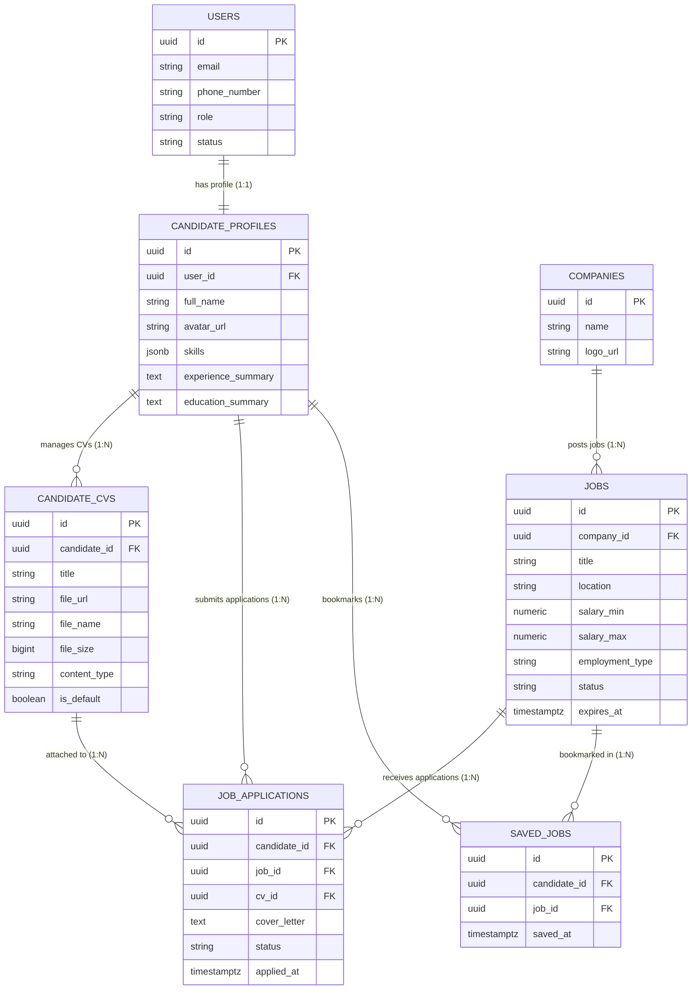

# Candidate Role — Software Requirements Specification

| Field | Value |
|---|---|
| **Project** | GuardianWork Recruitment Platform |
| **Module** | Candidate Role & Core Application Flow |
| **File** | `docs/feat/candidates/spec.md` |
| **Version** | 1.2.0 |
| **Date** | 2026-09-24 |
| **Status** | Draft / Proposed |

---

## Table of Contents

1. [Introduction](#1-introduction)
2. [Overall Description](#2-overall-description)
3. [Data Models](#3-data-models)
   - 3.1 [Entity Relationship Diagram (ERD)](#31-entity-relationship-diagram-erd)
   - 3.2 [Candidate User & Profile](#32-candidate-user--profile-tables)
   - 3.3 [Candidate CV](#33-candidate-cv-candidate_cvs-table)
   - 3.4 [Job Posting](#34-job-posting-jobs-table--candidate-view-read-model)
   - 3.5 [Job Application](#35-job-application-job_applications-table)
   - 3.6 [Database Indexes](#36-database-indexes)
4. [Functional Requirements](#4-functional-requirements)
5. [Flow Diagrams](#5-flow-diagrams)
6. [Business Rules](#6-business-rules)
7. [Error Catalogue](#7-error-catalogue)
8. [API Specification](#8-api-specification)
9. [Infrastructure Architecture](#9-infrastructure-architecture)
10. [Non-Functional Requirements](#10-non-functional-requirements)

---

## 1. Introduction

### 1.1 Purpose

This document defines the Software Requirements Specification (SRS) for the **Candidate Role** within the **GuardianWork** recruitment platform. It serves as the single source of truth for developers, QA engineers, product managers, and system architects regarding data models, operational flows, business constraints, API contracts, and feature prioritization (MVP vs. Post-MVP).

> **Note:** Dedicated authentication and account identity use cases (Registration, Login, Password Recovery, Account Settings) are managed by the core/common Authentication & Identity Module and are excluded from the candidate-specific functional domain.

### 1.2 Scope & MVP Phasing

All high-priority candidate domain use cases ([`docs/feat/candidates/usecase.md`](file:///home/miku/workspace/GuardianWork/guard-work/docs/feat/candidates/usecase.md)) are targeted for **MVP Phase (Phase 1)**. All Medium and Low priority use cases are designated for **Post-MVP Phase (Phase 2)**.

| Sub-feature / Group | Use Case Ref | Scope & Responsibility | Phase |
|---|---|---|---|
| **Personal Profile Update** | UC-CAN-01 | Edit contact details, skills, work experience, education | **MVP** |
| **Upload New CV** | UC-CAN-03 | Upload CV file (PDF/Word) to cloud object storage | **MVP** |
| **Job Search** | UC-CAN-07 | Search job postings by keyword, title, location | **MVP** |
| **View Job Details** | UC-CAN-09 | Display full job description, salary, requirements | **MVP** |
| **Apply for Job** | UC-CAN-11 | Submit application to a job posting | **MVP** |
| **Select / Attach CV** | UC-CAN-12 | Choose CV file to attach to job application (included in UC-CAN-11) | **MVP** |
| **View Applied Jobs** | UC-CAN-13 | Display candidate's job application history | **MVP** |
| **Track Application Status** | UC-CAN-14 | View current status & milestone updates of submitted application | **MVP** |
| CV Management | UC-CAN-02,04..06| Edit, delete, set default CV | Phase 2 |
| Filter Search Results | UC-CAN-08 | Refine search results by salary range, work type, experience | Phase 2 |
| Company Details | UC-CAN-10 | View company profile and open positions | Phase 2 |
| Save / Bookmark Job | UC-CAN-15, 16 | Save jobs to favorites and view saved jobs list | Phase 2 |
| Company Reviews | UC-CAN-17 | Post interview and work environment ratings for companies | Phase 2 |
| System Notifications | UC-CAN-18 | Receive in-app bell notifications for status changes | Phase 2 |

### 1.3 Technology Stack

| Layer | Technology |
|---|---|
| **Runtime** | Java 21 LTS |
| **Framework** | Spring Boot 3.3+ / 4.x |
| **Database** | PostgreSQL 16 (Flyway DB Migration scripts) |
| **ORM / Persistence** | Spring Data JPA / Hibernate |
| **Object Storage** | AWS S3 / MinIO (for storing uploaded CV documents) |
| **Cache & Ephemeral** | Redis (Session verification & caching) |
| **Full-Text Search** | PostgreSQL Full-Text Search / Elasticsearch |
| **Messaging** | Apache Kafka (publishing `application.submitted` events) |
| **Security / Auth** | Spring Security + JWT Bearer Tokens (HMAC-SHA256 / RSA) |

---

## 2. Overall Description

### 2.1 High-Level Flow

```
[Candidate User] (Authenticated via Common Auth Service)
       │
       ├─► [1. Complete Profile & Upload CV] ───► [S3 / PostgreSQL Storage]
       │
       ├─► [2. Search Jobs & View Details] ────► [Read Jobs DB / Search Index]
       │
       ├─► [3. Apply for Job] ─────────────────► [Validate & Create Application] ──► [Kafka Event]
       │
       └─► [4. Track Application Status] ──────► [Read Application Status History]
```

### 2.2 Application State Machine

```
                  ┌─────────────────────────────────────────┐
                  │                SUBMITTED                │ (Đã nộp)
                  └────────────────────┬────────────────────┘
                                       │
                                       ▼
                  ┌─────────────────────────────────────────┐
                  │                REVIEWED                 │ (Nhà tuyển dụng đã xem)
                  └────────────────────┬────────────────────┘
                                       │
                     ┌─────────────────┴─────────────────┐
                     │                                   │
                     ▼                                   ▼
  ┌─────────────────────────────────────┐ ┌─────────────────────────────────────┐
  │        INVITED_FOR_INTERVIEW        │ │              REJECTED               │ (Từ chối)
  └──────────────────┬──────────────────┘ └─────────────────────────────────────┘
                     │
                     ▼
  ┌─────────────────────────────────────┐
  │              ACCEPTED               │ (Trúng tuyển)
  └─────────────────────────────────────┘
```

### 2.3 Response Envelope

All API endpoints return the standardized JSON response envelope:

```json
{
  "status": 200,
  "message": "Application submitted successfully",
  "data": { ... }
}
```

For paginated listing responses (e.g. searching jobs or listing applied jobs), `data` complies with the project's standard `PageResponse` schema:

```json
{
  "status": 200,
  "message": "Query executed successfully",
  "data": {
    "content": [ ... ],
    "pageNumber": 0,
    "pageSize": 20,
    "totalElements": 42,
    "totalPages": 3,
    "first": true,
    "last": false
  }
}
```

### 2.4 Public vs Protected Endpoints

- **Public Endpoints**:
  - `GET /api/v1/jobs` (Job Listing / Search)
  - `GET /api/v1/jobs/{id}` (View Job Details)
- **Protected Endpoints (Requires `Authorization: Bearer <jwt>` with `ROLE_CANDIDATE`)**:
  - `GET /api/v1/candidate/profile`, `PUT /api/v1/candidate/profile`
  - `POST /api/v1/candidate/cvs`
  - `GET /api/v1/candidate/cvs`
  - `POST /api/v1/jobs/{id}/apply`
  - `GET /api/v1/candidate/applications`
  - `GET /api/v1/candidate/applications/{id}`

---

## 3. Data Models

### 3.1 Entity Relationship Diagram (ERD)



---

### 3.2 Candidate User & Profile Tables

#### `users` Table (Auth Domain Reference)
| Column | Type | Constraints | Description |
|---|---|---|---|
| `id` | UUID | PK, DEFAULT `gen_random_uuid()` | Unique user account identifier |
| `email` | VARCHAR(255) | NOT NULL, UNIQUE | User email address |
| `phone_number` | VARCHAR(20) | NULLABLE | Contact phone number |
| `role` | VARCHAR(30) | NOT NULL, DEFAULT `'CANDIDATE'` | Role marker (`CANDIDATE`, `EMPLOYER`, `ADMIN`) |
| `status` | VARCHAR(30) | NOT NULL, DEFAULT `'UNVERIFIED'` | Account state (`UNVERIFIED`, `ACTIVE`, `LOCKED`) |

#### `candidate_profiles` Table
| Column | Type | Constraints | Description |
|---|---|---|---|
| `id` | UUID | PK, DEFAULT `gen_random_uuid()` | Profile record ID |
| `user_id` | UUID | NOT NULL, FK(`users.id`), UNIQUE | Relational candidate user ID |
| `full_name` | VARCHAR(150) | NOT NULL | Full display name |
| `avatar_url` | VARCHAR(512) | NULLABLE | Profile picture URL |
| `skills` | JSONB | NULLABLE, DEFAULT `'[]'` | List of candidate skills |
| `experience_summary` | TEXT | NULLABLE | Summary of past work experience |
| `education_summary` | TEXT | NULLABLE | Summary of educational background |
| `created_at` | TIMESTAMPTZ | NOT NULL, DEFAULT `NOW()` | Record creation timestamp |
| `updated_at` | TIMESTAMPTZ | NOT NULL, DEFAULT `NOW()` | Record last updated timestamp |

---

### 3.3 Candidate CV (`candidate_cvs` table)

| Column | Type | Constraints | Description |
|---|---|---|---|
| `id` | UUID | PK, DEFAULT `gen_random_uuid()` | Unique CV record ID |
| `candidate_id` | UUID | NOT NULL, FK(`candidate_profiles.id`) | Foreign key to candidate profile |
| `title` | VARCHAR(150) | NOT NULL | Label or name of the CV |
| `file_url` | VARCHAR(512) | NOT NULL | Object storage URL (S3/MinIO) |
| `file_name` | VARCHAR(255) | NOT NULL | Original file name |
| `file_size` | BIGINT | NOT NULL | File size in bytes (max 10MB) |
| `content_type` | VARCHAR(100) | NOT NULL | MIME type (`application/pdf`, `application/msword`, etc.) |
| `is_default` | BOOLEAN | NOT NULL, DEFAULT `FALSE` | Indicates if this CV is default choice |
| `created_at` | TIMESTAMPTZ | NOT NULL, DEFAULT `NOW()` | Record creation timestamp |
| `updated_at` | TIMESTAMPTZ | NOT NULL, DEFAULT `NOW()` | Record last updated timestamp |

---

### 3.4 Job Posting (`jobs` table — Candidate View Read Model)

| Column | Type | Constraints | Description |
|---|---|---|---|
| `id` | UUID | PK | Job posting ID |
| `company_id` | UUID | NOT NULL, FK(`companies.id`) | Employer / Company identifier |
| `title` | VARCHAR(200) | NOT NULL | Job title |
| `location` | VARCHAR(150) | NOT NULL | Office / Remote work location |
| `salary_min` | NUMERIC(12,2) | NULLABLE | Minimum salary |
| `salary_max` | NUMERIC(12,2) | NULLABLE | Maximum salary |
| `employment_type` | VARCHAR(50) | NOT NULL | `FULL_TIME`, `PART_TIME`, `CONTRACT`, `REMOTE` |
| `description` | TEXT | NOT NULL | Job description |
| `requirements` | TEXT | NOT NULL | Candidate requirements |
| `benefits` | TEXT | NULLABLE | Perks & benefits |
| `status` | VARCHAR(30) | NOT NULL, DEFAULT `'ACTIVE'` | Job status (`DRAFT`, `ACTIVE`, `EXPIRED`, `CLOSED`) |
| `expires_at` | TIMESTAMPTZ | NOT NULL | Job posting deadline |

---

### 3.5 Job Application (`job_applications` table)

| Column | Type | Constraints | Description |
|---|---|---|---|
| `id` | UUID | PK, DEFAULT `gen_random_uuid()` | Unique application ID |
| `candidate_id` | UUID | NOT NULL, FK(`candidate_profiles.id`) | Applying candidate profile ID |
| `job_id` | UUID | NOT NULL, FK(`jobs.id`) | Target job posting ID |
| `cv_id` | UUID | NOT NULL, FK(`candidate_cvs.id`) | Attached CV document ID |
| `cover_letter` | TEXT | NULLABLE | Optional applicant cover letter |
| `status` | VARCHAR(50) | NOT NULL, DEFAULT `'SUBMITTED'` | Application state (See Section 2.2) |
| `applied_at` | TIMESTAMPTZ | NOT NULL, DEFAULT `NOW()` | Application submission timestamp |
| `updated_at` | TIMESTAMPTZ | NOT NULL, DEFAULT `NOW()` | Last status transition timestamp |

---

### 3.6 Database Indexes

| Index Name | Table | Column(s) | Purpose |
|---|---|---|---|
| `idx_candidate_profiles_user` | `candidate_profiles` | `user_id` (UNIQUE) | Fast lookup by user ID |
| `idx_candidate_cvs_candidate` | `candidate_cvs` | `candidate_id` | Fast fetch of candidate CV list |
| `idx_job_applications_unique` | `job_applications` | `(candidate_id, job_id)` (UNIQUE) | Prevent duplicate job applications |
| `idx_job_applications_candidate` | `job_applications` | `candidate_id, applied_at DESC` | Paginated listing of candidate applications |
| `idx_jobs_search_active` | `jobs` | `status, expires_at` | Accelerate search for active listings |

---

## 4. Functional Requirements

### 4.1 Profile & CV Management Module (MVP)

| Requirement ID | Priority | Description | Use Case Ref |
|---|---|---|---|
| **REQ-CAN-PROF-01** | **MVP** | The system **shall** allow logged-in candidates to update personal profile information (full name, phone, skills, experience, education). | UC-CAN-01 |
| **REQ-CAN-CV-01** | **MVP** | The system **shall** allow candidates to upload CV documents in PDF, DOC, or DOCX formats with a maximum file size of 10 MB. | UC-CAN-03 |
| **REQ-CAN-CV-02** | **MVP** | The system **shall** store uploaded CV files in S3/MinIO object storage and retain file metadata in PostgreSQL `candidate_cvs` table. | UC-CAN-03 |
| **REQ-CAN-CV-03** | **MVP** | The system **shall** allow candidates to list their uploaded CV files and select a specific CV when applying for a job. | UC-CAN-12 |
| REQ-CAN-CV-04 | Phase 2 | The system **shall** allow candidates to delete, rename, or mark a default CV. | UC-CAN-04..06 |

---

### 4.2 Job Discovery Module (MVP)

| Requirement ID | Priority | Description | Use Case Ref |
|---|---|---|---|
| **REQ-CAN-JOB-01** | **MVP** | The system **shall** provide a public search API allowing candidates to find active job postings by keyword (title, description, skills) and location. | UC-CAN-07 |
| **REQ-CAN-JOB-02** | **MVP** | The system **shall** return paginated search results containing job title, company name, location, salary range, and posting date. | UC-CAN-07 |
| **REQ-CAN-JOB-03** | **MVP** | The system **shall** allow any user to view detailed job posting information (full description, requirements, benefits, expiration date). | UC-CAN-09 |
| REQ-CAN-JOB-04 | Phase 2 | The system **shall** allow candidates to filter job search results by salary range, employment type, and experience level. | UC-CAN-08 |

---

### 4.3 Job Application & Status Tracking Module (MVP)

| Requirement ID | Priority | Description | Use Case Ref |
|---|---|---|---|
| **REQ-CAN-APP-01** | **MVP** | The system **shall** allow authenticated candidates to apply for an active job posting by selecting an uploaded CV and submitting an optional cover letter. | UC-CAN-11, UC-CAN-12 |
| **REQ-CAN-APP-02** | **MVP** | The system **shall** verify that the target job posting is in `ACTIVE` state and `expires_at > NOW()`. If expired or inactive, application **must** be rejected with HTTP 400. | UC-CAN-11 |
| **REQ-CAN-APP-03** | **MVP** | The system **shall** enforce uniqueness on `(candidate_id, job_id)`. If candidate has already applied, the system **shall** return HTTP 409 Conflict. | UC-CAN-11 |
| **REQ-CAN-APP-04** | **MVP** | Upon successful application creation, the system **shall** set initial status to `SUBMITTED` and publish an `application.submitted` event to Apache Kafka. | UC-CAN-11 |
| **REQ-CAN-APP-05** | **MVP** | The system **shall** allow candidates to view a paginated list of all jobs they have applied for, including job details, application date, and current status. | UC-CAN-13, UC-CAN-14 |
| **REQ-CAN-APP-06** | **MVP** | The system **shall** allow candidates to view detailed state machine progress (`SUBMITTED` → `REVIEWED` → `INVITED_FOR_INTERVIEW` → `ACCEPTED` / `REJECTED`) for a specific application. | UC-CAN-14 |

---

## 5. Flow Diagrams

### 5.1 Job Application Submission Flow (MVP)

```
Candidate               Frontend API              Backend Service             S3 Storage             PostgreSQL              Kafka Queue
    │                        │                           │                         │                      │                       │
    │── 1. Upload CV ───────►│                           │                         │                      │                       │
    │                        │── 2. POST /candidate/cvs ─►│                        │                      │                       │
    │                        │                           │── 3. Save File ────────►│                      │                       │
    │                        │                           │◄── File URL ────────────│                      │                       │
    │                        │                           │── 4. Insert Metadata ─────────────────────────►│                       │
    │◄── CV ID Returned ─────│◄── 201 Created ───────────│                                                 │                       │
    │                        │                           │                                                 │                       │
    │── 5. Apply for Job ───►│                           │                                                 │                       │
    │                        │── 6. POST /jobs/{id}/apply│                                                 │                       │
    │                        │   (cvId, coverLetter)     │── 7. Check Duplicate & Job Expiry ───────────────►│                       │
    │                        │                           │◄── Valid ───────────────────────────────────────│                       │
    │                        │                           │── 8. Insert Application (SUBMITTED) ───────────►│                       │
    │                        │                           │── 9. Publish `application.submitted` ──────────────────────────────────►│
    │◄── Application Done ───│◄── 201 Created ───────────│                                                                         │
```

---

## 6. Business Rules

| ID | Business Rule Statement |
|---|---|
| **BR-CAN-01** | **Single Application Limit:** A candidate can apply to a specific job posting exactly once. Re-application for the same job posting ID is forbidden. |
| **BR-CAN-02** | **CV File Restrictions:** Uploaded CV files must be of format `.pdf`, `.doc`, or `.docx` and must not exceed 10 MB in file size. |
| **BR-CAN-03** | **Active Job Constraint:** Applications are accepted only for jobs with `status = 'ACTIVE'` and `expires_at > CURRENT_TIMESTAMP`. |
| **BR-CAN-04** | **Immutability of Submitted CV:** The CV file associated with a submitted application must remain accessible to the hiring manager even if the candidate uploads newer CV versions later. |
| **BR-CAN-05** | **Resource Access Control (RBAC):** Candidates can only view and query their own profile, CVs, and application history. Accessing another candidate's resources returns HTTP 403 Forbidden. |

---

## 7. Error Catalogue

| Error Code | HTTP Status | Constant | Trigger Condition |
|---|---|---|---|
| `40001` | 400 | `INVALID_INPUT_DATA` | Request body validation failure (missing required fields) |
| `40003` | 400 | `INVALID_CV_FILE_FORMAT` | Uploaded file extension/MIME type is not PDF/DOC/DOCX |
| `40004` | 400 | `FILE_SIZE_EXCEEDS_LIMIT` | Uploaded CV file size exceeds 10 MB |
| `40005` | 400 | `JOB_EXPIRED_OR_INACTIVE` | Attempting to apply to a job that is closed or past expiration date |
| `40101` | 401 | `UNAUTHENTICATED` | Missing, expired, or invalid JWT Bearer token |
| `40301` | 403 | `FORBIDDEN` | Authenticated candidate lacks authorization or attempts to view another user's resource |
| `40401` | 404 | `CANDIDATE_NOT_FOUND` | Candidate profile record does not exist |
| `40402` | 404 | `JOB_NOT_FOUND` | Specified job posting ID does not exist |
| `40403` | 404 | `CV_NOT_FOUND` | Specified CV document ID does not exist or does not belong to candidate |
| `40404` | 404 | `APPLICATION_NOT_FOUND` | Specified application ID does not exist |
| `40901` | 409 | `DUPLICATE_APPLICATION` | Candidate has already applied to this job posting |

---

## 8. API Specification

### Conventions
- **Base URL:** `http://localhost:8080/api/v1`
- **Auth Header:** `Authorization: Bearer <jwt_access_token>`
- **Content-Type:** `application/json` (except file upload endpoints which use `multipart/form-data`)

---

### 8.1 Profile & CV Management APIs (MVP)

#### `PUT /api/v1/candidate/profile` — Update Profile (UC-CAN-01)

**Request Body**
```json
{
  "fullName": "Nguyen Van A",
  "phoneNumber": "0987654321",
  "skills": ["Java", "Spring Boot", "PostgreSQL"],
  "experienceSummary": "3 years experience in Backend Software Engineering.",
  "educationSummary": "Bachelor of Computer Science - HUST"
}
```

**Response `200 OK`**
```json
{
  "status": 200,
  "message": "Profile updated successfully",
  "data": {
    "profileId": "a1b2c3d4-e5f6-7a8b-9c0d-1e2f3a4b5c6d",
    "fullName": "Nguyen Van A",
    "phoneNumber": "0987654321",
    "skills": ["Java", "Spring Boot", "PostgreSQL"],
    "experienceSummary": "3 years experience in Backend Software Engineering.",
    "educationSummary": "Bachelor of Computer Science - HUST",
    "updatedAt": "2026-09-24T21:30:00Z"
  }
}
```

---

#### `POST /api/v1/candidate/cvs` — Upload CV File (UC-CAN-03)

**Request Header:** `Content-Type: multipart/form-data`  
**Form Fields:**
- `file`: (Binary File, required, max 10MB)
- `title`: `Software Engineer Resume 2026` (String, required)

**Response `201 Created`**
```json
{
  "status": 201,
  "message": "CV uploaded successfully",
  "data": {
    "cvId": "f47ac10b-58cc-4372-a567-0e02b2c3d4e5",
    "title": "Software Engineer Resume 2026",
    "fileName": "nguyen_van_a_cv.pdf",
    "fileUrl": "https://storage.guardianwork.com/cvs/550e8400/nguyen_van_a_cv.pdf",
    "fileSize": 1048576,
    "contentType": "application/pdf",
    "createdAt": "2026-09-24T21:35:00Z"
  }
}
```

---

### 8.2 Job Discovery APIs (MVP)

#### `GET /api/v1/jobs` — Search Jobs (UC-CAN-07)

**Query Parameters:**
- `keyword` (optional): `Backend`
- `location` (optional): `Ha Noi`
- `page` (optional, default 0): `0`
- `size` (optional, default 20): `20`

**Response `200 OK`**
```json
{
  "status": 200,
  "message": "Jobs retrieved successfully",
  "data": {
    "content": [
      {
        "id": "c7a8b9c0-d1e2-3f4a-5b6c-7d8e9f0a1b2c",
        "title": "Senior Java Backend Engineer",
        "companyName": "Tech Corp",
        "location": "Ha Noi",
        "salaryMin": 2000.00,
        "salaryMax": 3500.00,
        "employmentType": "FULL_TIME",
        "expiresAt": "2026-10-31T23:59:59Z"
      }
    ],
    "pageNumber": 0,
    "pageSize": 20,
    "totalElements": 1,
    "totalPages": 1,
    "first": true,
    "last": true
  }
}
```

---

#### `GET /api/v1/jobs/{id}` — View Job Details (UC-CAN-09)

**Response `200 OK`**
```json
{
  "status": 200,
  "message": "Job details retrieved successfully",
  "data": {
    "id": "c7a8b9c0-d1e2-3f4a-5b6c-7d8e9f0a1b2c",
    "title": "Senior Java Backend Engineer",
    "companyName": "Tech Corp",
    "location": "Ha Noi",
    "salaryMin": 2000.00,
    "salaryMax": 3500.00,
    "employmentType": "FULL_TIME",
    "description": "We are seeking an experienced Senior Java Developer...",
    "requirements": "Minimum 4 years with Spring Boot, PostgreSQL, Kafka...",
    "benefits": "Competitive salary, 13th-month bonus, healthcare...",
    "status": "ACTIVE",
    "expiresAt": "2026-10-31T23:59:59Z"
  }
}
```

---

### 8.3 Application APIs (MVP)

#### `POST /api/v1/jobs/{id}/apply` — Submit Job Application (UC-CAN-11, UC-CAN-12)

**Request Body**
```json
{
  "cvId": "f47ac10b-58cc-4372-a567-0e02b2c3d4e5",
  "coverLetter": "Dear Hiring Team, I am writing to express my strong interest..."
}
```

**Response `201 Created`**
```json
{
  "status": 201,
  "message": "Job application submitted successfully",
  "data": {
    "applicationId": "b9c0d1e2-f3a4-5b6c-7d8e-9f0a1b2c3d4e",
    "jobId": "c7a8b9c0-d1e2-3f4a-5b6c-7d8e9f0a1b2c",
    "jobTitle": "Senior Java Backend Engineer",
    "cvId": "f47ac10b-58cc-4372-a567-0e02b2c3d4e5",
    "status": "SUBMITTED",
    "appliedAt": "2026-09-24T21:40:00Z"
  }
}
```

---

#### `GET /api/v1/candidate/applications` — View Applied Jobs List (UC-CAN-13, UC-CAN-14)

**Response `200 OK`**
```json
{
  "status": 200,
  "message": "Applications retrieved successfully",
  "data": {
    "content": [
      {
        "applicationId": "b9c0d1e2-f3a4-5b6c-7d8e-9f0a1b2c3d4e",
        "jobId": "c7a8b9c0-d1e2-3f4a-5b6c-7d8e9f0a1b2c",
        "jobTitle": "Senior Java Backend Engineer",
        "companyName": "Tech Corp",
        "status": "SUBMITTED",
        "appliedAt": "2026-09-24T21:40:00Z"
      }
    ],
    "pageNumber": 0,
    "pageSize": 20,
    "totalElements": 1,
    "totalPages": 1,
    "first": true,
    "last": true
  }
}
```

---

## 9. Infrastructure Architecture

### 9.1 Storage Strategy (AWS S3 / MinIO)

- **Bucket:** `guardianwork-cvs`
- **Object Key Structure:** `cvs/{candidate_user_id}/{cv_uuid}_{filename}`
- **Pre-signed URL TTL:** 15 minutes (for secure direct download by authorized employers)

---

## 10. Non-Functional Requirements

| ID | Category | Requirement |
|---|---|---|
| **NFR-01** | **Performance** | Public job search and detail retrieval endpoints **shall** respond in < 200 ms under standard peak load. |
| **NFR-02** | **Security** | CV download links **must** use short-lived presigned URLs to prevent unauthorized public file harvesting. |
| **NFR-03** | **Data Integrity** | Database operations for submitting applications **must** execute in a single isolated transaction (`@Transactional`), rolling back if Kafka event publishing or table insert fails. |
| **NFR-04** | **Scalability** | Search queries **must** leverage indexed fields to support horizontal database scaling and high concurrency. |
| **NFR-05** | **Auditability** | All application state transitions (`SUBMITTED` → `REVIEWED` → ...) **must** generate immutable audit log entries with timestamps. |
